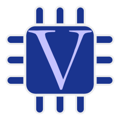

## 👋 About Me:

- 🎓 I'm currently studying at the University of Information Technology, VNU - HCM City.  
- 🔭 I’m currently studying and working on IC design projects focusing on RTL design.
- 💬 Ask me about Verilog/VHDL, pipelined processors, and FPGA toolchains.
- 🤓 I'm very interested in RTL, FPGA Design, Computer Architecture, etc.  

## 🌐 Socials : 

  
  
  

## 💻 Languages :

  
  
  
  
  

## 📊 GitHub stats :

  
  
  

